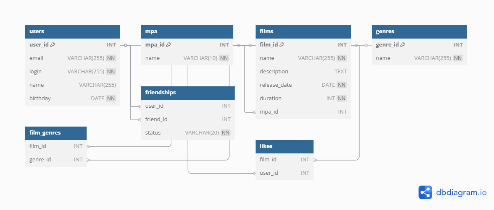

Filmorate — это сервис для оценки фильмов, где пользователи могут лайкать фильмы, дружить и находить самые популярные киноленты.


ER-диаграмма базы данных




- **`users`** — хранит пользователей.
- **`mpa_ratings`** — возрастные рейтинги (G, PG и т. д.).
- **`films`** — информация о фильмах.
- **`genres`** — жанры фильмов.
- **`film_genres`** — связь фильмов с жанрами.
- **`friendships`** — дружеские связи между пользователями.
- **`likes`** — лайки пользователей к фильмам.


Получить топ-5 самых популярных фильмов
```
SELECT f.film_id, f.name, COUNT(l.user_id) AS likes_count
FROM films f
LEFT JOIN likes l ON f.film_id = l.film_id
GROUP BY f.film_id, f.name
ORDER BY likes_count DESC
LIMIT 5;
```
SQL-запросы

Добавить друга (ожидает подтверждения)
```
INSERT INTO friendships (user_id, friend_id, status)
VALUES ($1, $2, 'неподтверждено');
```

Подтвердить дружбу

```
UPDATE friendships
SET status = 'подтверждено'
WHERE user_id = $2 AND friend_id = $1;
```

Лайкнуть фильм
```
INSERT INTO likes (film_id, user_id)
VALUES ($1, $2)
ON CONFLICT DO NOTHING;
```